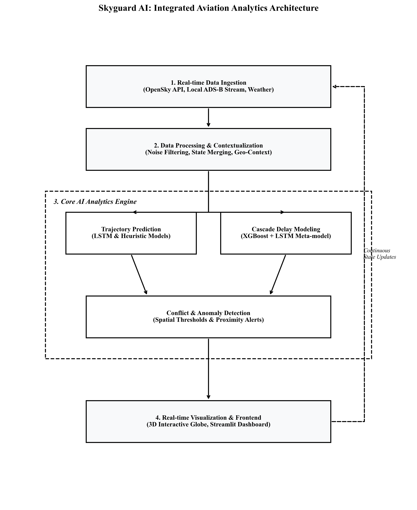

<div align="center">

<h1>🛡️ SkyGuard AI</h1>
<h3>Integrated Aviation Analytics Platform</h3>

[](https://python.org)
[](https://fastapi.tiangolo.com)
[](https://react.dev)
[](https://tensorflow.org)
[](LICENSE)
[](/.github/workflows/ci.yml)

<br/>

> **Real-time, AI-powered aviation situational awareness** — from raw ADS-B telemetry to interactive 3D globe visualization, conflict detection, and cascade delay forecasting.

<br/>



</div>

---

## 📑 Table of Contents

- [Abstract](#-abstract)
- [Architecture](#-system-architecture)
- [Features](#-features)
- [Tech Stack](#-tech-stack)
- [Installation](#-installation)
- [Usage](#-usage)
- [Dataset](#-dataset)
- [Model Performance](#-model-performance)
- [Folder Structure](#-folder-structure)
- [API Reference](#-api-reference)
- [Contributing](#-contributing)
- [License](#-license)
- [Author](#-author)

---

## 📖 Abstract

SkyGuard AI is a production-grade, full-stack aviation intelligence platform built for AI & Data Science research. It ingests real-time global flight state vectors from the **OpenSky Network API** and **ADS-B radio streams**, fuses them with live weather data, and runs them through a multi-model AI engine to:

1. **Predict future flight trajectories** using an LSTM neural network trained on historical lat/lon sequences.
2. **Detect live airspace conflicts** using a 3D Haversine grid-bucket algorithm with sub-10 km resolution.
3. **Forecast cascade delay propagation** using an XGBoost base model + LSTM propagation model + stacked meta-model ensemble.
4. **Visualize everything** on an interactive WebGL 3D globe (React + Three.js) and a Streamlit analytics dashboard.

This project was developed as a capstone for the **AI in Transportation & Logistics** course (B.Tech, 6th Semester, AI & Data Science).

---

## 🏗️ System Architecture

```
┌─────────────────────────────────────────────────────────────────────┐
│                     SKYGUARD AI — DATA FLOW                         │
├─────────────────────────────────────────────────────────────────────┤
│                                                                     │
│  ┌──────────────┐   ┌──────────────┐   ┌───────────┐  ┌─────────┐  │
│  │ OpenSky API  │   │  ADS-B Stream│   │ Weather   │  │Aviation │  │
│  │ (REST/JSON)  │   │ (1090 MHz CSV│   │ API (JSON)│  │Registry │  │
│  └──────┬───────┘   └──────┬───────┘   └─────┬─────┘  └────┬────┘  │
│         │                  │                  │             │       │
│         └──────────────────▼──────────────────▼─────────────▼──┐   │
│                    ┌───────────────────────────────────┐        │   │
│                    │     DATA FETCHER & STREAMER        │        │   │
│                    │  data_fetcher.py / adsb_streamer   │        │   │
│                    └──────────────┬────────────────────┘        │   │
│                                   │                             │   │
│                    ┌──────────────▼────────────────────┐        │   │
│                    │  PREPROCESSING & FUSION PIPELINE  │        │   │
│                    │  data_preprocessing.py / geo_ctx  │        │   │
│                    │  merge_data.py / registry_cleaner │◄───────┘   │
│                    └──────────────┬────────────────────┘            │
│                                   │                                 │
│         ┌─────────────────────────┼───────────────────────┐         │
│         │                         │                       │         │
│  ┌──────▼───────┐    ┌────────────▼──────┐   ┌───────────▼──────┐  │
│  │    LSTM      │    │   CONFLICT        │   │  DELAY CASCADE   │  │
│  │  Trajectory  │    │   DETECTOR        │   │  XGB + LSTM +    │  │
│  │  Predictor   │    │ (Haversine Grid)  │   │  Meta-Model      │  │
│  │  predict.py  │    │conflict_detector  │   │delay_propagation │  │
│  └──────┬───────┘    └────────┬──────────┘   └───────┬──────────┘  │
│         │                     │                      │              │
│         └──────────────────── ▼──────────────────────┘             │
│                    ┌───────────────────────────────────┐            │
│                    │     CENTRAL STATE BRIDGE          │            │
│                    │         bridge.py                 │            │
│                    └──────────────┬────────────────────┘            │
│                                   │                                 │
│              ┌────────────────────┼─────────────────────┐           │
│              │                    │                     │           │
│  ┌───────────▼──────┐  ┌──────────▼──────┐  ┌──────────▼────────┐  │
│  │   FastAPI REST   │  │    Streamlit    │  │   React 3D Globe  │  │
│  │      app.py      │  │ streamlit_app   │  │  Globe.tsx + Vite │  │
│  │  /flights        │  │  Plotly Charts  │  │  Three.js / WebGL │  │
│  │  /conflicts      │  │  KPI Metrics    │  │  D3-Geo Arcs      │  │
│  │  /predict        │  └─────────────────┘  └───────────────────┘  │
│  │  /delay-*        │                                               │
│  └──────────────────┘                                               │
└─────────────────────────────────────────────────────────────────────┘
```

---

## ✨ Features

| Feature | Description |
|---|---|
| 🌍 **3D Live Globe** | Interactive WebGL globe with real-time aircraft positions via Three.js + D3-Geo |
| 🤖 **LSTM Trajectory Prediction** | Predicts next N spatial coordinates using trained LSTM on lat/lon sequences |
| ⚠️ **Real-time Conflict Detection** | 3D Haversine grid-bucket algorithm detecting aircraft within configurable distance threshold |
| 🔮 **Future Conflict Forecasting** | Extrapolates trajectories to find upcoming airspace intersections before they happen |
| 📊 **Cascade Delay Modeling** | XGBoost + LSTM propagation + stacked meta-model simulating how a first-flight delay ripples through an aircraft's full day |
| 🌦️ **Weather-Aware Analytics** | Integrates weather grids (wind, precipitation, visibility) as delay model features |
| 📡 **Dual Data Sources** | Switches between live OpenSky Network API and local ADS-B CSV simulation |
| 🔁 **Resilient Data Fetching** | Automatic backoff, caching, and local CSV fallback on API rate limiting |
| 📈 **Streamlit Analytics Dashboard** | Plotly charts, KPI metrics, flight trajectory replay |
| 🔌 **FastAPI REST Backend** | Streaming JSON responses for low-latency frontend polling |

---

## 🛠️ Tech Stack

### Backend (Python)

| Library | Version | Purpose |
|---|---|---|
| FastAPI | `0.115+` | Async REST API server |
| Uvicorn | `0.34+` | ASGI server for FastAPI |
| TensorFlow / Keras | `2.x` | LSTM model training & inference |
| XGBoost | `2.x` | Base delay prediction model |
| Scikit-learn | `1.x` | MinMaxScaler, preprocessing |
| Pandas | `2.x` | DataFrame operations, data fusion |
| NumPy | `1.26+` | Numerical computations |
| Joblib | `1.x` | Model serialization (.pkl, .save) |
| Requests | `2.x` | OpenSky Network API HTTP client |
| Streamlit | `1.x` | Analytics dashboard UI |
| Plotly | `5.x` | Interactive charts in Streamlit |
| python-dotenv | `1.x` | Environment variable loading |

### Frontend (TypeScript / Node.js)

| Library | Version | Purpose |
|---|---|---|
| React | `19.0` | UI framework |
| Vite | `6.x` | Build tool & dev server |
| Three.js | `0.183` | 3D WebGL rendering |
| @react-three/fiber | `9.x` | React renderer for Three.js |
| @react-three/drei | `10.x` | Three.js helpers |
| D3-Geo | `3.x` | Geographic projections for globe arcs |
| Axios | `1.x` | HTTP client for backend polling |
| TailwindCSS | `4.x` | Utility-first CSS framework |
| Lucide-React | `0.546` | Icon library |
| Motion | `12.x` | Animation library |

---

## 🚀 Installation

### Prerequisites

- [Node.js](https://nodejs.org/) v18+
- [Python](https://python.org/) 3.10+
- [Git](https://git-scm.com/)

### 1. Clone the Repository

```bash
git clone https://github.com/yourusername/skyguard-ai.git
cd skyguard-ai
```

### 2. Set Up Environment Variables

```bash
cp .env.example .env
# Edit .env and fill in your API keys
```

Required keys:
- `SKYGUARD_OPENSKY_USERNAME` — OpenSky Network account username
- `SKYGUARD_OPENSKY_PASSWORD` — OpenSky Network account password
- `SKYGUARD_WEATHER_API_KEY` — WeatherAPI.com API key

### 3. Install Frontend Dependencies

```bash
npm install
```

### 4. Install Backend Dependencies

```bash
# Create a virtual environment (recommended)
python -m venv venv

# Activate it
# Windows PowerShell:
.\venv\Scripts\Activate.ps1
# Mac/Linux:
source venv/bin/activate

# Install all Python packages
pip install -r requirements.txt
```

### 5. (Optional) Download Delay Propagation Models

The cascade delay module requires pre-trained models in `external/delay_propagation/Delay_Propagation/models/`. See [docs/dataset.md](docs/dataset.md) for download instructions.

---

## 💻 Usage

### Start All Services

You need **two terminals** (three for the Streamlit dashboard):

**Terminal 1 — Frontend (React + Vite)**
```bash
npm run dev
# App available at http://localhost:5173
```

**Terminal 2 — Backend API (FastAPI)**
```bash
cd backend
uvicorn app:app --reload --port 8000
# API available at http://localhost:8000
# API docs at http://localhost:8000/docs
```

**Terminal 3 — Analytics Dashboard (Optional)**
```bash
cd backend
streamlit run streamlit_app.py
# Dashboard at http://localhost:8501
```

### Using the Makefile (Shortcut)

```bash
make install     # Install all dependencies
make run         # Start frontend + backend simultaneously
make train       # Train the LSTM trajectory model
make test        # Run all unit tests
make lint        # Run type checks
make clean       # Remove dist/, __pycache__, .pytest_cache/
```

### API Quick Reference

```bash
# Get all live flight states
curl http://localhost:8000/flights

# Get current + predicted conflicts
curl http://localhost:8000/conflicts

# Predict next 5 trajectory points for a flight
curl -X POST http://localhost:8000/predict \
  -H "Content-Type: application/json" \
  -d '{"trajectory": [[28.6, 77.2], [28.7, 77.4], [28.8, 77.6]], "steps": 5}'

# Get delay simulation metadata
curl "http://localhost:8000/delay-propagation/meta?mode=demo"

# Run cascade delay simulation
curl -X POST http://localhost:8000/delay-propagation/simulate \
  -H "Content-Type: application/json" \
  -d '{"mode": "demo", "tail": "N12345", "date": "2024-01-15"}'
```

---

## 📊 Dataset

| Dataset | Source | Size | Description |
|---|---|---|---|
| **OpenSky States** | [opensky-network.org](https://opensky-network.org) | Live API | Global ADS-B flight state vectors (ICAO24, lat, lon, alt, velocity, heading) |
| **ADS-B CSV** | Local capture | ~56 MB (`raw_adsb.csv`) | Historical ADS-B 1090MHz decoded messages |
| **Cleaned ADS-B** | Preprocessed | ~2.5 MB (`adsb_cleaned.csv`) | Noise-filtered, interpolated flight records |
| **OpenSky Log** | Cached API | ~586 KB (`opensky_log.csv`) | Timestamped API snapshots for trajectory replay |
| **Aircraft Registry** | [OpenSky DB](https://opensky-network.org/aircraft-database) | ~41 MB (`.json.gz`) | Static aircraft metadata (type, wake category) |
| **Delay Demo Dataset** | Synthetic | CSV | Aviation industry demo dataset for delay propagation simulation |

See [docs/dataset.md](docs/dataset.md) for full schema details.

---

## 📈 Model Performance

### LSTM Trajectory Predictor

| Metric | Value |
|---|---|
| Architecture | 2-layer LSTM (64→32 units) + Dense(16→2) |
| Input Features | `[lat, lon]` sequences (window=5) |
| Loss Function | Mean Squared Error (MSE) |
| Optimizer | Adam |
| Training Epochs | 5 |
| Fallback | Linear heuristic path extrapolation |

### Cascade Delay Propagation (XGBoost + LSTM Ensemble)

| Model | Role | Key Features |
|---|---|---|
| **XGBoost Base** | First-flight base delay | Wind speed, precipitation, visibility, congestion ratio, turnaround time |
| **LSTM Propagation** | Delay spillover | Historical delay sequence per aircraft tail |
| **Meta-Model** | Ensemble combiner | Blends XGB + LSTM outputs for final prediction |

| Metric | Value |
|---|---|
| Delay Features | 16 (weather + traffic + temporal) |
| Prediction Type | Regression (delay in minutes) |
| Explainability | SHAP contributions via XGBoost `pred_contribs` |

---

## 📁 Folder Structure

```
skyguard-ai/
├── .github/
│   ├── workflows/
│   │   └── ci.yml                  # GitHub Actions CI pipeline
│   ├── ISSUE_TEMPLATE/
│   │   ├── bug_report.md
│   │   └── feature_request.md
│   ├── PULL_REQUEST_TEMPLATE.md
│   └── CONTRIBUTING.md
│
├── backend/                        # Python backend
│   ├── app.py                      # FastAPI REST server
│   ├── bridge.py                   # Central state manager bridge
│   ├── streamlit_app.py            # Streamlit analytics dashboard
│   ├── data/                       # Local data files
│   │   ├── adsb_cleaned.csv
│   │   ├── cleaned_data.csv
│   │   ├── opensky_log.csv
│   │   ├── lstm_model.keras
│   │   └── scaler.pkl
│   └── src/                        # Core Python modules
│       ├── __init__.py
│       ├── data_fetcher.py         # OpenSky API + local CSV ingestion
│       ├── adsb_streamer.py        # ADS-B CSV chunk streamer
│       ├── adsb_cleaner.py         # ADS-B noise filtering
│       ├── data_preprocessing.py  # Cleaning & region filtering
│       ├── geo_context.py          # Spatial context resolution
│       ├── merge_data.py           # Multi-source data fusion
│       ├── conflict_detector.py   # Real-time conflict detection
│       ├── future_conflict_detector.py # Predicted path conflicts
│       ├── predict.py              # LSTM inference wrapper
│       ├── train_lstm.py           # LSTM training script
│       ├── forecasting.py          # Heuristic path extrapolation
│       ├── delay_propagation.py   # Cascade delay simulation engine
│       ├── analysis.py             # Traffic analytics & briefing
│       ├── visualization.py        # Plotly chart generators
│       ├── weather_service.py      # Weather API client
│       ├── data_logger.py          # CSV data logger
│       └── main_loop.py            # Background polling daemon
│
├── src/                            # React/TypeScript frontend
│   ├── App.tsx                     # Main application component
│   ├── main.tsx                    # Vite entry point
│   ├── index.css                   # Global styles
│   ├── types.ts                    # TypeScript type definitions
│   ├── constants.ts                # App constants
│   ├── components/
│   │   ├── Globe.tsx               # 3D WebGL globe component
│   │   ├── GlobeOptimized.tsx      # Performance-optimized globe
│   │   ├── ConflictSection.tsx     # Conflict display panel
│   │   ├── DelayPropagationSection.tsx # Delay sim UI
│   │   ├── StatsSection.tsx        # KPI statistics panel
│   │   └── FlightDetails.tsx       # Per-flight detail card
│   ├── services/
│   │   └── flightEngine.ts         # API polling + data transform
│   └── lib/
│       └── utils.ts                # Frontend utility functions
│
├── external/                       # External ML packages
│   └── delay_propagation/
│       └── Delay_Propagation/
│           ├── models/             # Pre-trained model files
│           │   ├── xgb_base.json
│           │   ├── lstm_prop.keras
│           │   └── meta_model.pkl
│           └── simulation/
│               └── engine.py       # Delay simulation engine
│
├── tests/                          # Unit tests
│   ├── __init__.py
│   ├── test_data.py
│   ├── test_model.py
│   └── test_utils.py
│
├── docs/                           # Documentation
│   ├── architecture.md
│   ├── api_reference.md
│   ├── dataset.md
│   └── results.md
│
├── notebooks/                      # Jupyter notebooks
│   ├── 01_EDA.ipynb
│   ├── 02_Preprocessing.ipynb
│   ├── 03_Modeling.ipynb
│   └── 04_Evaluation.ipynb
│
├── .github/                        # GitHub configuration
├── .env.example                    # Environment variable template
├── .gitignore
├── config.yaml                     # Project configuration
├── requirements.txt                # Python dependencies
├── package.json                    # Node.js dependencies
├── Makefile                        # Developer command shortcuts
├── Dockerfile                      # Container build
├── docker-compose.yml              # Multi-service orchestration
├── vite.config.ts                  # Vite build configuration
├── tsconfig.json                   # TypeScript configuration
├── technical_process_flow.md       # Architecture deep-dive
└── README.md
```

---

## 🤝 Contributing

Contributions are welcome! Please read [.github/CONTRIBUTING.md](.github/CONTRIBUTING.md) first.

1. Fork the repository
2. Create your feature branch: `git checkout -b feat/my-new-feature`
3. Commit your changes: `git commit -m 'feat: add some feature'`
4. Push to the branch: `git push origin feat/my-new-feature`
5. Open a Pull Request

---

## 📜 License

This project is licensed under the **MIT License** — see the [LICENSE](LICENSE) file for details.

---

## 👤 Author

**Abhishek S.**
B.Tech — Artificial Intelligence & Data Science (3rd Year)

- 📧 Email: `abhishek.s_btech23@gsv.ac.in`
- 🐙 GitHub: [@yourusername](https://github.com/yourusername)

---

<div align="center">
<sub>Built with ❤️ for AI in Transportation & Logistics — B.Tech Capstone Project</sub>
</div>
