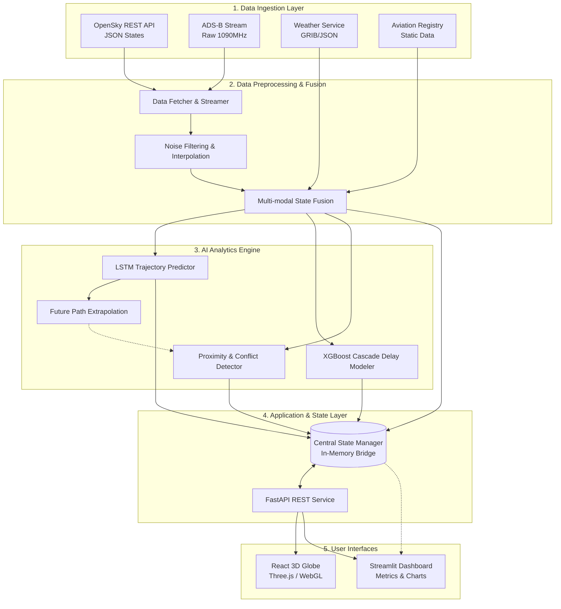
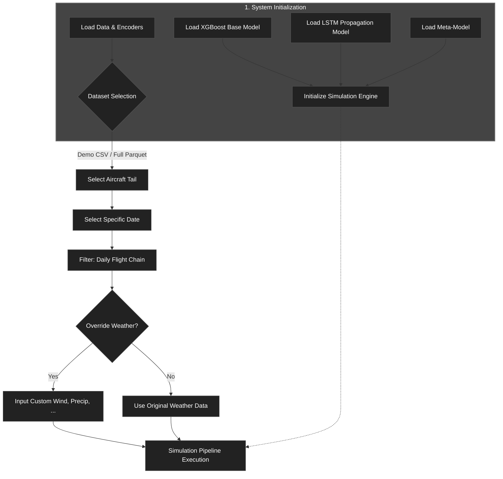

# Skyguard AI: End-to-End Technical Process Flow

This document outlines the complete technical execution flow for the **Skyguard AI: Integrated Aviation Analytics** platform. It covers the journey of data from raw ingestion to final user visualization.

## 1. High-Level Architecture Diagram

---

## 2. Detailed Technical Process Breakdown

### Phase 1: Data Ingestion (The Source)
The system operates asynchronously to gather disparate data streams in real-time.
*   **`data_fetcher.py` / `adsb_streamer.py`**: A continuous polling mechanism interfaces with the OpenSky Network API to gather global flight state vectors (Latitude, Longitude, Altitude, Velocity, Heading, ICAO24).
*   **`weather_service.py`**: Fetches real-time localized weather data (wind gradients, temperature) required for accurate delay and trajectory modeling.
*   **Static Assets**: Pulls from local registry files to append fixed flight metadata (aircraft type, wake turbulence category).

### Phase 2: Preprocessing & Fusion (The Pipeline)
Raw data cannot be fed directly into ML models. It must be cleaned and synchronized.
*   **`data_preprocessing.py`**: Executes noise filtering to drop corrupted packets and imputes missing coordinates via linear interpolation. 
*   **`geo_context.py`**: Applies spatial filters (e.g., bounding boxes for specific global regions) and maps states against terrestrial terrain definitions.
*   **`merge_data.py`**: Aligns timestamped flight vectors with asynchronous weather grids and static registry data to create a unified `FlightState` object.

### Phase 3: AI Analytics Engine (The Brain)
The cleaned, unified data branches into concurrent predictive models.
*   **Trajectory Prediction (`predict.py`, `train_lstm.py`)**: Uses a trained LSTM (Long Short-Term Memory) neural network to predict the next `N` spatial coordinates of a flight based on historical velocity and heading. (Falls back to `forecasting.py` heuristic math if ML confidence is low).
*   **Cascade Delay Modeling (`analysis.py`, `delays.py`)**: Utilizes XGBoost and an LSTM Meta-model. It computes localized base delays using weather/traffic density, and simulates network-wide "spillover" delays affecting consecutive flights.
*   **Conflict Detection (`conflict_detector.py`, `future_conflict_detector.py`)**: Computes 3D Haversine distances. Checks current states for immediate proximity threshold breaches and analyzes extrapolated future trajectories for anticipated collisions.

### Phase 4: Application Layer (The Bridge)
This acts as the intermediary broker between the heavy backend computations and lightweight frontend clients.
*   **`bridge.py` / `main_loop.py`**: A continuous background daemon that loops over the AI Analytics outputs and updates a centralized dictionary/state object in memory. 
*   **`app.py`**: A FastAPI web server that mounts REST endpoints (`/flights`, `/predict`, `/conflicts`, `/dashboard`) to serve the latest state dictionary as serialized JSON payloads upon request.

### Phase 5: User Interfaces (The Presentation)
*   **React 3D Globe (`Globe.tsx`)**: The Vite + React frontend continually polls the FastAPI `/flights` endpoint. It leverages Three.js and D3.js to map the 2D geospatial coordinates onto an interactive 3D WebGL sphere, drawing interpolated arcs for trajectories.
*   **Streamlit Analytics (`streamlit_app.py`)**: Connects directly to the backend state bridge. It renders complex dataframes, Plotly time-series charts, and aggregated KPI metrics (like system-wide delay averages and active conflicts) for detailed analytical reviews.

---

## 3. Delay Simulation Process Flow

The system takes historical or demo aviation data, selects a specific aircraft's daily flight sequence, and runs it through a series of machine learning models to simulate how delays propagate throughout the day.

